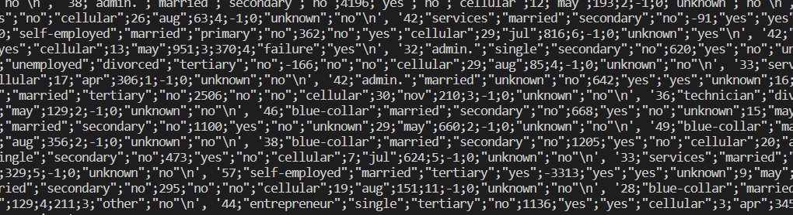
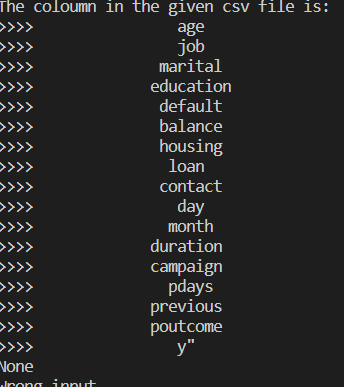
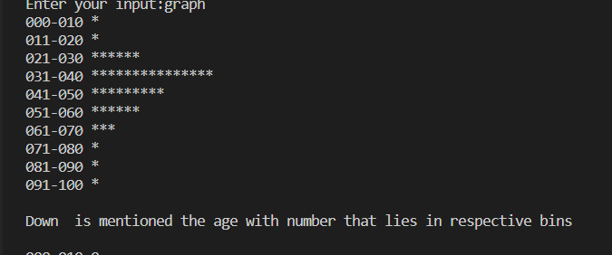
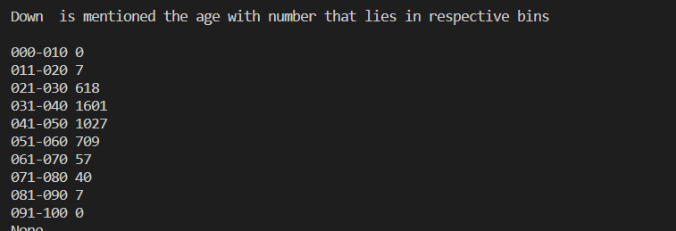
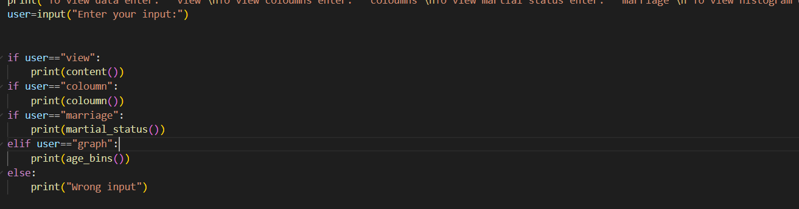
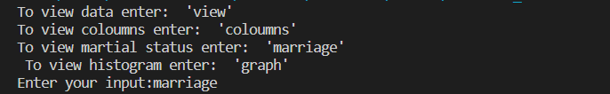

# 22112371_Kanishk-Saleria_BEA372
 Labwork
## Lab 1

### Introduction
This lab is about working with a given dataset of a bank (bank.csv) and performing various operations on it using Python. It was instructed to use no library while coding the functions.

### Functions

* `content()`: This function opens the Bank.csv dataset without using any libraries.

* `coloumns()`: This function prints the headers in the Bank.csv file.

* `marital_status()`: This function finds the count of customers in each category 'marital'.

* `age_bins()`: This function prepares a histogram for age using print statements.

### Usage
1. Clone the repository to your local machine.
2. Open you Integrated Development Enviornment(IDE).
3. Run the following command to execute the program:

4. The program will display a menu with the following options:

5. Select an option by entering its corresponding keyword and pressing Enter.

### Conclusion
This lab demonstrates how to work with a dataset in Python without using any libraries and perform various operations on it.

